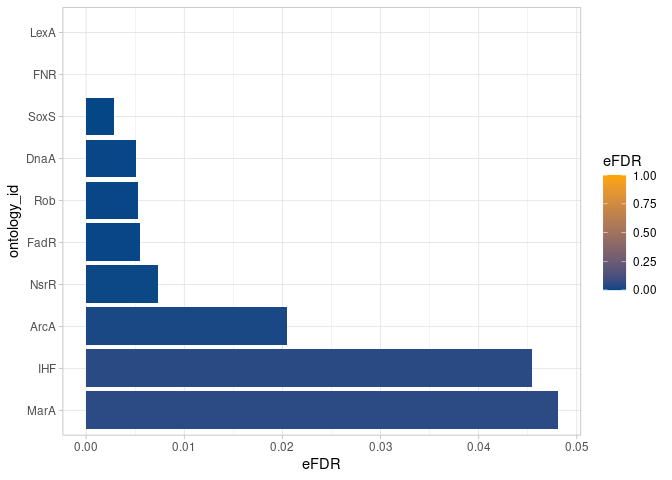
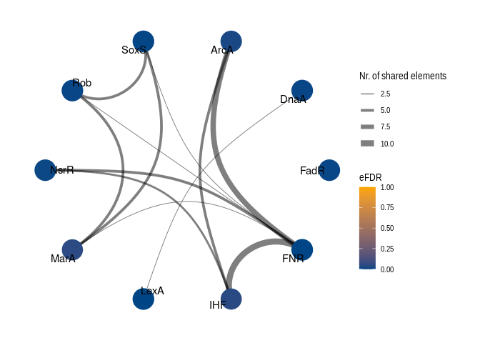
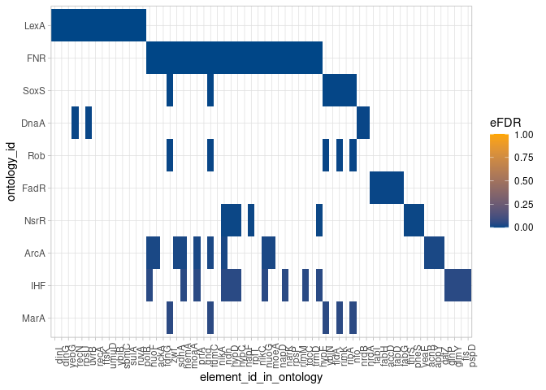
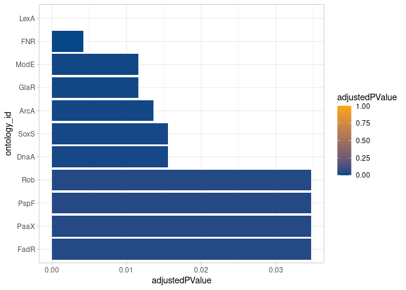
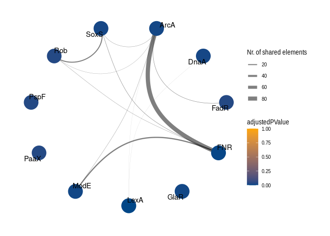
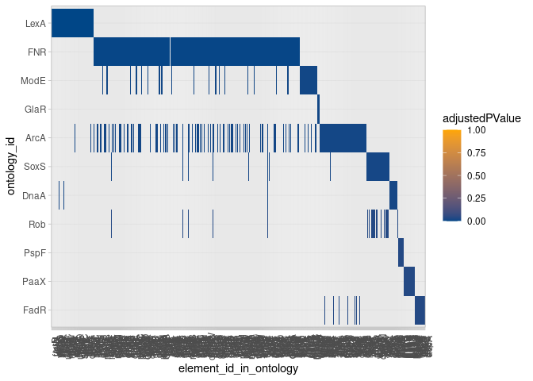

# *mulea*: an *R* package for Multi-Enrichment Analysis


## Installing the *mulea* package using *devtools*

``` r
library(devtools)
install_github("https://github.com/ELTEbioinformatics/mulea.git")
```

## An example of how to use the *mulea* package

### The data set to be analysed

-   Processed microarray data from NCBI  database: [GSE55662](https://www.ncbi.nlm.nih.gov/geo/query/acc.cgi?acc=GSE55662)
-   Published by [Méhi *et al.* (2014) in *Molecular Biology and Evolution*](https://doi.org/10.1093/molbev/msu223).
-   The authors studied the evolution of antibiotic resistance in *Escerichia coli* bacteria.
-   Bacteria were treated with the antibiotic drug *ciprofloxacin* gene expression changes were measured.
-   For the differential expression analysis using [GEO2R](https://www.ncbi.nlm.nih.gov/geo/geo2r/?acc=GSE55662), the following comparisons were made:
    -   Non-treated wild-type control samples (2 biological replicates) *vs.*
    -   Wild-type samples treated with *ciprofloxacin* (2 biological replicates)

Reading the table containing the results of the differential expression analysis:

``` r
library(mulea)
library(tidyverse)

Geo2R_result_tab <- read_tsv("GSE55662.table_wt_non_vs_cipro.tsv")
```

Let's see the first 3 rows of the `Geo2R_result_tab` data.frame:

| ID           | adj.P.Val | P.Value |    t |       B | logFC | Gene.symbol                  | Gene.title                                                                                                            |
|:------|------:|------:|------:|------:|------:|:------|:---------------------------|
| 1765336_s_at |    0.0186 | 2.4e-06 | 21.5 | 4.95769 |  3.70 | gnsB                         | Qin prophage; multicopy suppressor of secG(Cs) and fabA6(Ts)                                                          |
| 1760422_s_at |    0.0186 | 3.8e-06 | 19.6 | 4.68510 |  3.14 | NA                           | NA                                                                                                                    |
| 1764904_s_at |    0.0186 | 5.7e-06 | 18.2 | 4.43751 |  2.54 | sulA///sulA///sulA///ECs1042 | SOS cell division inhibitor///SOS cell division inhibitor///SOS cell division inhibitor///SOS cell division inhibitor |

We need to format the data.frame before using it for enrichment analysis. This step is specific to the type of microarray has been used. 
*Note*: **positive** *logFC*-s indicate **overexpression** under *ciprofloxacin* treatment.

``` r
Geo2R_result_tab %<>% 
  # extracting the first gene symbol from the Gene.symbol column
  mutate(Gene.symbol = str_remove(string = Gene.symbol,
                                  pattern = "\\/.*")) %>% 
  # removing rows where Gene.symbol is NA
  filter(!is.na(Gene.symbol)) %>% 
  # ordering by logFC
  arrange(desc(logFC))
```

Let's see what changed in the first 3 rows of the `Geo2R_result_tab` data.frame:

| ID           | adj.P.Val |  P.Value |    t |       B | logFC | Gene.symbol | Gene.title                                                                                                                                |
|:-----|-----:|-----:|-----:|-----:|-----:|:-----|:-------------------------------|
| 1765336_s_at |    0.0186 | 2.40e-06 | 21.5 | 4.95769 |  3.70 | gnsB        | Qin prophage; multicopy suppressor of secG(Cs) and fabA6(Ts)                                                                              |
| 1764904_s_at |    0.0186 | 5.70e-06 | 18.2 | 4.43751 |  2.54 | sulA        | SOS cell division inhibitor///SOS cell division inhibitor///SOS cell division inhibitor///SOS cell division inhibitor                     |
| 1761763_s_at |    0.0186 | 1.54e-05 | 15.0 | 3.73568 |  2.16 | recN        | recombination and repair protein///recombination and repair protein///recombination and repair protein///recombination and repair protein |

### The database for the enrichment analysis

-   We were curious about which **transcription factors** regulate the expression of the significantly overexpressed genes.
-   Therefore, we used the *mulea* package to perform multi-enrichment analysis on the  [database](https://regulondb.ccg.unam.mx/).
-   The *GMT* file containing genes symbols regulated by transcription factors was downloaded from the [Github page of mulea](https://github.com/ELTEbioinformatics/mulea/blob/main/GMT/83333_Escherichia_coli/RegulonDB_Escherichia_coli_genesymbol_Leila.gmt).

Reading the *GMT* file containing the lists of gene symbols each transcription factor (indicated with gene symbols as well) regulates:

``` r
Regulon_GMT <- read_gmt("RegulonDB_Escherichia_coli_genesymbol.gmt")
```

How many transcription factors are in the *Regulon GMT* file?

``` r
nrow(Regulon_GMT)
```

> 211

Let's see the first 3 rows of the `Regulon_GMT` data.frame:

| ontology_id | ontology_name | list_of_values |
|:-----------|:-------------|:-------------|
| AccB       | "AccB"       | accC, accB   |
| AcrR       | "AcrR"       | marB, ma.... |
| Ada        | "Ada"        | alkB, ad.... |

We have to mention that the in the *Regulon GMT* files both the `ontology_id` ans the `ontology_name` columns contain the gene symbols of the transcription factors. In the case of some other *GMT* files, *i.e.* the *GO GMT* files, the `ontology_id` column contains the GO IDs and the `ontology_name` column contains the GO terms.

The `list_of_values` lists of the gene symbols that are regulated by the transcription factor indicated in the `ontology_id` column. To see all such genes for example in the case of the transcription factor *AcrR*, we can use the following code:

``` r
Regulon_GMT$list_of_values[[which(Regulon_GMT$ontology_id == "AcrR")]]
```

> marB marR marA acrB micF flhD acrR flhC acrA soxS soxR

#### Filtering the ontology entries

When interpreting the results of enrichment analyses, one may encounter the problem of the results being dominated by either overly specific or overly broad ontology entries being enriched. In *mulea*, users can tailor the size of the ontology entries to their specific requirements, ensuring that the results match the expected scope.

Let's see the distribution of number of elements (gene symbols) in the `list_of_values` column to decide if we need to exclude too specific or too broad ontology entries:

``` r
Nr_of_elements_in_ontology <- Regulon_GMT$list_of_values %>% 
  map_dbl(length)

ggplot(mapping = aes(Nr_of_elements_in_ontology)) + 
  geom_bar() +
  theme_minimal()
```


We now see that there are some ontology entries containing more than 200 gene symbols. These transcription factors regulate a lot of genes, therefore not specific enough. We will exclude these from the enrichment analysis.

We also see that there are some ontology entries with only a small number of elements. Let's zoom in to this part of the distribution:

``` r
ggplot(mapping = aes(Nr_of_elements_in_ontology)) + 
  geom_bar() +
  xlim(0, 15) +
  theme_minimal()
```


Let's exclude the ontology entries containing less than 3 or more than 400 gene symbols and check the remaining number of transcription factors:

``` r
Regulon_GMT_filtered <- filter_ontology(gmt = Regulon_GMT,
                                        min_nr_of_elements = 3,
                                        max_nr_of_elements = 400)
```

How many transcription factors are in the filtered *GMT* object?

``` r
nrow(Regulon_GMT_filtered)
```

> 154

We even can save the filtered *GMT* object to a file:

``` r
write_gmt(gmt = Regulon_GMT_filtered, 
          file = "RegulonDB_Escherichia_coli_genesymbol_filtered.gmt")
```

### Overrepresentation analysis (ORA)

#### Preparing input data for the ORA

##### Creating the "*test*" gene set

A vector containing the gene symbols of significantly overexpressed ($adjusted\ p-value < 0.05$) genes with greater than 2 fold-change ($logFC > 1$).

``` r
E.coli_sign_genes <- Geo2R_result_tab %>% 
  # filtering for adjusted p-value < 0.05 and logFC > 1
  filter(adj.P.Val < 0.05
         & logFC > 1) %>% 
  # selecting the Gene.symbol column
  select(Gene.symbol) %>% 
  # convert tibble to vector
  pull() %>% 
  # removing duplicates
  unique() %>% 
  # sorting
  sort()
```

Let's see the first 10 elements of the `E.coli_sign_genes` vector:

``` r
E.coli_sign_genes %>% 
  head(10)
```

> accD ackA acnB agp appY aroC asnC bglA bioD btuB

Let's see the number of genes in the `E.coli_sign_genes` vector:

``` r
E.coli_sign_genes %>% 
  length()
```

> 241

##### Creating the "*background*" gene set

A vector containing the gene symbols of all genes were included in the differential expression analysis.

``` r
E.coli_background_genes <- Geo2R_result_tab %>% 
  # selecting the Gene.symbol column
  select(Gene.symbol) %>% 
  # convert tibble to vector
  pull() %>% 
  # removing duplicates
  unique() %>% 
  # sorting
  sort()
```

Let's see the number of genes in the `E.coli_background_genes` vector:

``` r
E.coli_background_genes %>% 
  length()
```

> 7381

### Performing the ORA

Let's correct for multiple testing using the *empirical FDR* method with 10,000 permutations:

``` r
# creating the ORA model using the GMT variable
ora_model <- ora(gmt = Regulon_GMT_filtered, 
                 # the test gene set variable
                 element_names = E.coli_sign_genes, 
                 # the background gene set variable
                 background_element_names = E.coli_background_genes, 
                 # the p-value adjustment method
                 p_value_adjustment_method = "eFDR", 
                 # the number of permutations
                 number_of_permutations = 10000,
                 # the number of processor threads to use
                 number_of_cpu_threads = 4) 

# running the ORA
ora_results <- run_test(ora_model)
```

#### The results of the ORA

The `ora_results` is a data.frame containing the enriched transcription factors and the corresponding $p$ and $empirical\ FDR$ values.

Let's see the number of "enriched" transcription factors:

``` r
ora_results %>%
  filter(eFDR < 0.05) %>% 
  nrow()
```

> 10

Let's see the significant part of the `ora_results` data.frame:

| ontology_id | ontology_name | nr_common_with_tested_elements | nr_common_with_backgound_elements |   p_value |      eFDR |
|:----------|:----------|------------:|--------------:|----------:|----------:|
| FNR         | "FNR"         |                             26 |                               259 | 0.0000003 | 0.0000000 |
| LexA        | "LexA"        |                             14 |                                53 | 0.0000000 | 0.0000000 |
| SoxS        | "SoxS"        |                              7 |                                37 | 0.0001615 | 0.0028000 |
| DnaA        | "DnaA"        |                              4 |                                13 | 0.0006281 | 0.0051333 |
| Rob         | "Rob"         |                              5 |                                21 | 0.0004717 | 0.0052400 |
| FadR        | "FadR"        |                              5 |                                20 | 0.0003692 | 0.0054500 |
| NsrR        | "NsrR"        |                              8 |                                64 | 0.0010478 | 0.0073286 |
| ArcA        | "ArcA"        |                             12 |                               148 | 0.0032001 | 0.0204250 |
| IHF         | "IHF"         |                             14 |                               205 | 0.0070758 | 0.0454700 |
| MarA        | "MarA"        |                              5 |                                37 | 0.0066068 | 0.0480333 |

### Visualizing the ORA results

Initializing the visualization:

``` r
ora_reshaped_results <- reshape_results(model = ora_model, 
                                        model_results = ora_results, 
                                        # choosing which column to use for the indication of significance
                                        p_value_type_colname = "eFDR")
```

#### Barplot -\> Lollipop plot

The bars and their colouring show the significance levels of the enriched ontologies (transcription factors).

``` r
plot_barplot(reshaped_results = ora_reshaped_results,
             # the column containing the names we wish to plot
             ontology_id_colname = "ontology_id",
             # upper threshold for the value indicating the significance
             p_value_max_threshold = 0.05,
             # column that indicates the significance values
             p_value_type_colname = "eFDR")
```



#### Network plot

The function creates a network plot of the enriched ontologies (transcription factors). The nodes are the ontology IDs (*Regulon IDs*) coloured according to their significance level. Two nodes are connected if they have at least one shared element (gene which expression level was influenced by both of the transcription factor). The edges are weighted by the number of common elements between the nodes.

``` r
plot_graph(reshaped_results = ora_reshaped_results,
           # the column containing the names we wish to plot
           ontology_id_colname = "ontology_id",
           # upper threshold for the value indicating the significance
           p_value_max_threshold = 0.05,
           # column that indicates the significance values
           p_value_type_colname = "eFDR")
```



#### Heatmap

The actual elements (genes) of the enriched ontologies (transcription factors) connected with. The rows are the ontology IDs (*Regulon IDs*) coloured according to their significance level. The columns are the elements (genes) of the ontologies.

``` r
plot_heatmap(reshaped_results = ora_reshaped_results,
             # the column containing the names we wish to plot
             ontology_id_colname = "ontology_id",
             # column that indicates the significance values
             p_value_type_colname = "eFDR")
```



### Gene set enrichment analysis (GSEA)

#### Preparing input data for the GSEA

A data.frame containing all the genes which expression were measured in the differential expression analysis and their log fold change values ($logFC$). (Or two vectors containing the gene symbols and the corresponding $logFC$ values.)

``` r
# if there are duplicated Gene.symbols keep the first one only
Geo2R_result_tab_filtered <- Geo2R_result_tab %>% 
  # grouping by Gene.symbol to be able to filter
  group_by(Gene.symbol) %>%
  # keeping the first row for each Gene.symbol from rows with the same Gene.symbol
  filter(row_number()==1) %>% 
  ungroup() %>% 
  # arranging by logFC in descending order
  arrange(desc(logFC)) %>%
  select(Gene.symbol, logFC)
```

Let's check the number of gene symbols in the `E.coli_ordered_genes` vector:

``` r
Geo2R_result_tab_filtered %>% 
  nrow()
```

> 7381

#### Performing the GSEA

Let's correct for multiple testing using the *empirical FDR* method with 10,000 permutations:

``` r
gsea_model <- gsea(gmt = Regulon_GMT_filtered,
                   element_names = Geo2R_result_tab_filtered$Gene.symbol,
                   element_scores = Geo2R_result_tab_filtered$logFC,
                   # consider elements having positive logFC values only
                   element_score_type = "pos",
                   number_of_permutations = 10000)

gsea_results <- run_test(gsea_model)
```

### Visualizing the GSEA results

Initializing the visualization:

``` r
gsea_reshaped_results <- reshape_results(model = gsea_model, 
                                         model_results = gsea_results, 
                                         model_ontology_col_name = "ontology_id",
                                         ontology_id_colname = "ontology_id",
                                         # choosing which column to use for the indication of significance
                                         p_value_type_colname = "adjustedPValue")
```

#### Barplot -\> Lollipop plot

The bars and their colouring show the significance levels of the enriched ontologies (transcription factors).

``` r
plot_barplot(reshaped_results = gsea_reshaped_results,
             # the column containing the names we wish to plot
             ontology_id_colname = "ontology_id",
             # upper threshold for the value indicating the significance
             p_value_max_threshold = 0.05,
             # column that indicates the significance values
             p_value_type_colname = "adjustedPValue")
```



#### Network plot

The function creates a network plot of the enriched ontologies (transcription factors). The nodes are the ontology IDs (*Regulon IDs*) coloured according to their significance level. Two nodes are connected if they have at least one shared element (gene which expression level was influenced by both of the transcription factor). The edges are weighted by the number of common elements between the nodes.

``` r
plot_graph(reshaped_results = gsea_reshaped_results,
           # the column containing the names we wish to plot
           ontology_id_colname = "ontology_id",
           # upper threshold for the value indicating the significance
           p_value_max_threshold = 0.05,
           # column that indicates the significance values
           p_value_type_colname = "adjustedPValue")
```



#### Heatmap

The actual elements (genes) of the enriched ontologies (transcription factors) connected with. The rows are the ontology IDs (*Regulon IDs*) coloured according to their significance level. The columns are the elements (genes) of the ontologies.

``` r
plot_heatmap(reshaped_results = gsea_reshaped_results,
             # the column containing the names we wish to plot
             ontology_id_colname = "ontology_id",
             # column that indicates the significance values
             p_value_type_colname = "adjustedPValue")
```



## Session info

``` r
sessionInfo()
```

```         
R version 4.3.1 (2023-06-16)
Platform: x86_64-pc-linux-gnu (64-bit)
Running under: Ubuntu 22.04.3 LTS

Matrix products: default
BLAS:   /usr/lib/x86_64-linux-gnu/blas/libblas.so.3.10.0 
LAPACK: /usr/lib/x86_64-linux-gnu/lapack/liblapack.so.3.10.0

locale:
 [1] LC_CTYPE=en_US.UTF-8       LC_NUMERIC=C              
 [3] LC_TIME=pl_PL.UTF-8        LC_COLLATE=en_US.UTF-8    
 [5] LC_MONETARY=pl_PL.UTF-8    LC_MESSAGES=en_US.UTF-8   
 [7] LC_PAPER=pl_PL.UTF-8       LC_NAME=C                 
 [9] LC_ADDRESS=C               LC_TELEPHONE=C            
[11] LC_MEASUREMENT=pl_PL.UTF-8 LC_IDENTIFICATION=C       

time zone: Europe/Warsaw
tzcode source: system (glibc)

attached base packages:
[1] stats     graphics  grDevices utils     datasets  methods   base     

other attached packages:
 [1] lubridate_1.9.2 forcats_1.0.0   stringr_1.5.0   dplyr_1.1.2    
 [5] purrr_1.0.1     readr_2.1.4     tidyr_1.3.0     tibble_3.2.1   
 [9] ggplot2_3.4.2   tidyverse_2.0.0 mulea_0.99.10  

loaded via a namespace (and not attached):
 [1] fastmatch_1.1-3     gtable_0.3.3        xfun_0.39          
 [4] ggrepel_0.9.3       lattice_0.21-8      tzdb_0.4.0         
 [7] vctrs_0.6.3         tools_4.3.1         generics_0.1.3     
[10] parallel_4.3.1      fansi_1.0.4         pkgconfig_2.0.3    
[13] Matrix_1.6-1        data.table_1.14.8   lifecycle_1.0.3    
[16] compiler_4.3.1      farver_2.1.1        munsell_0.5.0      
[19] ggforce_0.4.1       fgsea_1.26.0        graphlayouts_1.0.0 
[22] codetools_0.2-19    htmltools_0.5.5     yaml_2.3.7         
[25] pillar_1.9.0        crayon_1.5.2        MASS_7.3-60        
[28] BiocParallel_1.34.2 viridis_0.6.3       tidyselect_1.2.0   
[31] digest_0.6.32       stringi_1.7.12      labeling_0.4.2     
[34] cowplot_1.1.1       polyclip_1.10-4     fastmap_1.1.1      
[37] grid_4.3.1          colorspace_2.1-0    cli_3.6.1          
[40] magrittr_2.0.3      ggraph_2.1.0        tidygraph_1.2.3    
[43] utf8_1.2.3          withr_2.5.0         scales_1.2.1       
[46] bit64_4.0.5         timechange_0.2.0    rmarkdown_2.25     
[49] igraph_1.5.0        bit_4.0.5           gridExtra_2.3      
[52] hms_1.1.3           evaluate_0.21       knitr_1.43         
[55] viridisLite_0.4.2   rlang_1.1.1         Rcpp_1.0.10        
[58] glue_1.6.2          tweenr_2.0.2        rstudioapi_0.14    
[61] vroom_1.6.3         jsonlite_1.8.7      R6_2.5.1           
[64] plyr_1.8.8         
```
